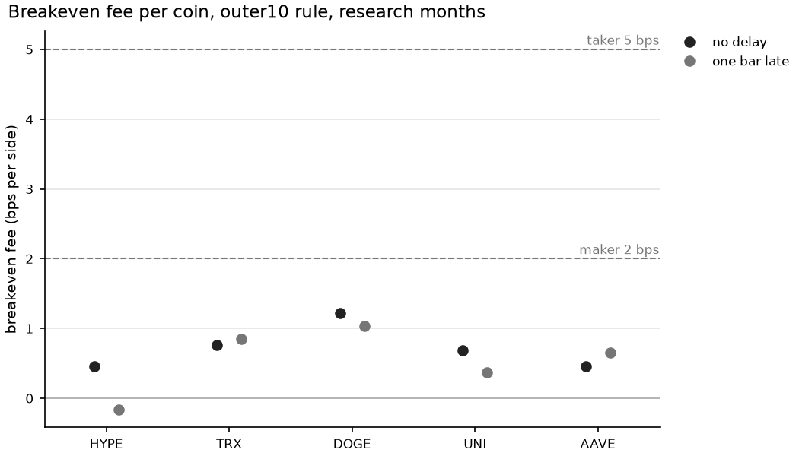
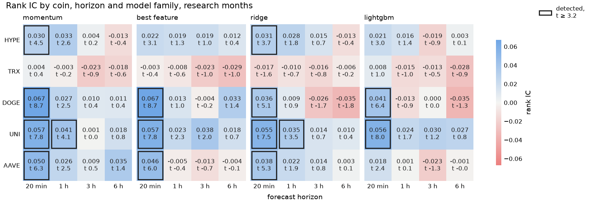
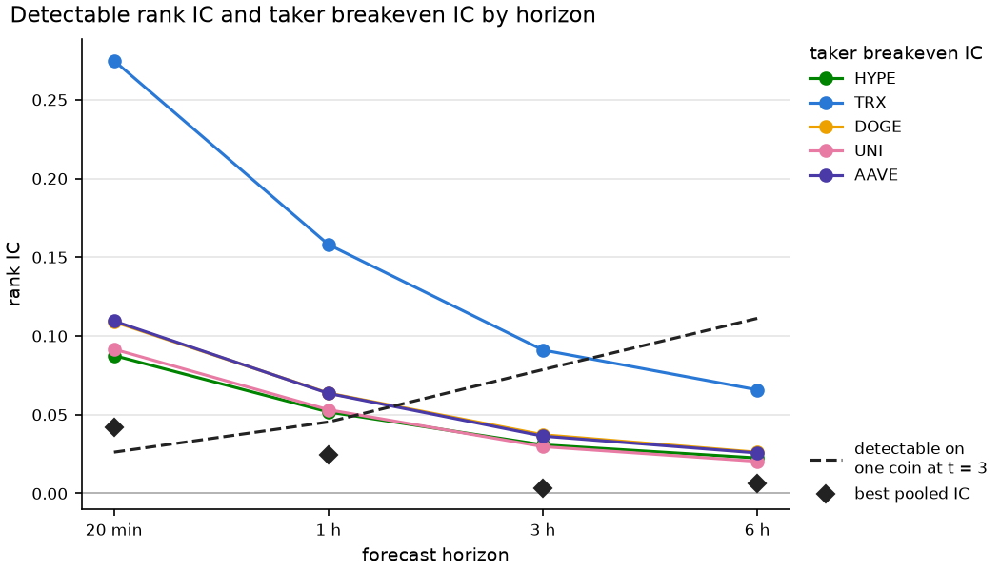
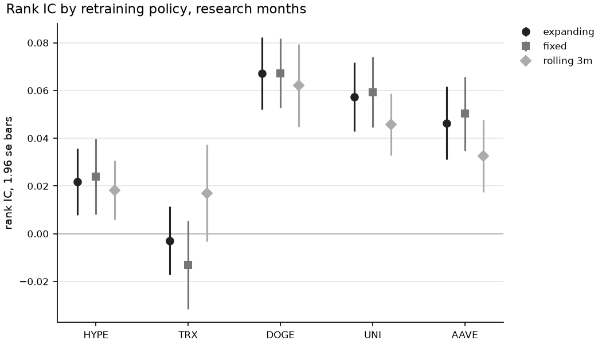
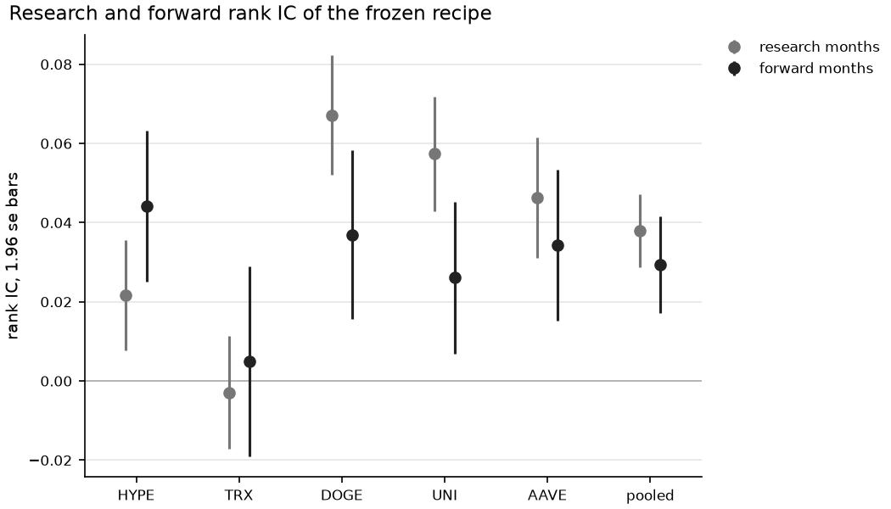
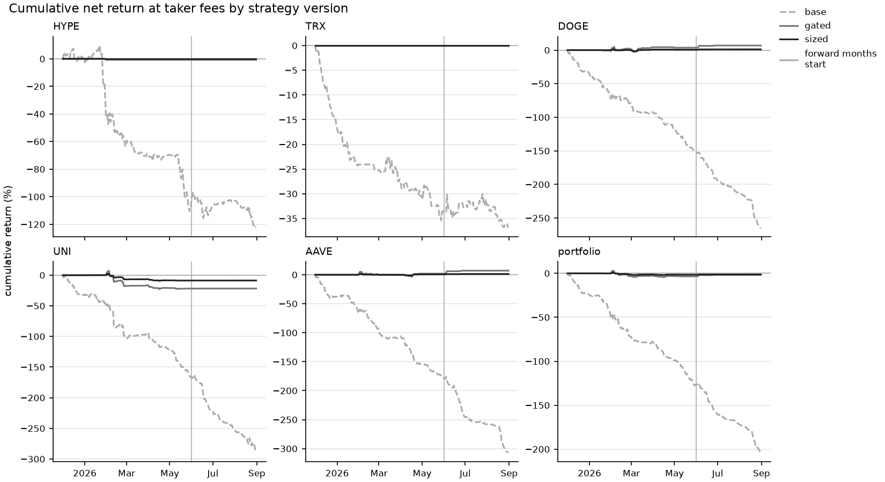

# Walk-Forward Tests of Short-Horizon Return Models on Five Binance Perpetuals

[](https://github.com/nemanull/binance_data_combinator/actions/workflows/ci.yml)
[](https://www.python.org/downloads/)
[](https://github.com/astral-sh/uv)
[](https://github.com/astral-sh/ruff)

## Question

Can 5-minute bars predict the returns of crypto perpetual futures over the next 20 minutes to 6 hours well enough to pay for trading them?
I tested this on five Binance USD-M perpetuals, HYPE, TRX, DOGE, UNI and AAVE, with BTC, ETH and SOL as context.
Each model is retrained every month on everything before that month and scored only on that month.
Every modelling choice was made on six research months, December 2025 to May 2026, and frozen before the forward months, June to August 2026, were scored.

## Verdict

The returns are a little predictable at 20 minutes, but not enough to pay for trading them.

- At 20 minutes HYPE, DOGE, UNI and AAVE partly reverse their last 20-minute move, in the research months and again in the forward months.
  TRX shows no signal at any horizon, and beyond 1 hour no coin does.
- The edge of the five-coin portfolio, its breakeven fee, is under 1 bp per side, while Binance's regular fees are 2 bps per side for a maker and 5 for a taker, so the portfolio loses money after fees in both periods.
  In the forward months HYPE alone made money with the frozen strategy at maker fees, and the 90 percent interval of its Sharpe ratio includes zero.
- BTC, ETH and SOL add nothing, a one-input rule does as well as ridge and LightGBM, and a model trained once does as well as monthly refits.
- Volatility is an order of magnitude easier to predict than direction, but trading only when forecast volatility makes the expected edge cover the fee cuts the taker loss to about zero, mostly by not trading, and the strategy still does not pay.
- One model trained on all five coins does no better than five separate ones.

The numbers below are for the frozen strategy, which predicts each coin's next 20 minutes from one input and trades only the outer 10 percent of its predictions on each side.
For DOGE and UNI that input is the coin's own last 20-minute return in every research month, and for AAVE in four of six, so the strategy bets on the reversal.

| | Research, Dec 2025 to May 2026 | Forward, Jun to Aug 2026 |
| --- | ---: | ---: |
| Pooled rank IC of the frozen 20-minute rule | 0.038 (t 8.0) | 0.029 (t 4.7) |
| Breakeven fee, bps per side | 0.74 | 0.45 |
| Portfolio net at maker fees, bps a day | -20.7 | -28.3 |
| Portfolio net at taker fees, bps a day | -69.9 | -83.3 |

The rank IC is the rank correlation between the prediction and the return that follows, so 0 means no skill, and pooled means averaged over the five coins.
The breakeven fee is the fee per side at which net profit would be zero.



In the research months every coin's breakeven fee under the frozen strategy is below the 2 bps maker fee and far below the 5 bps taker fee, whether the trade is placed at the close of the signal bar or one bar later.
No coin's gross profit reaches a t-statistic of 2, so the differences between coins, TRX's included, could be noise.

My reading is that the reversal is the move a market maker earns when takers push the price and it partly comes back.
A retail account captures it only by paying the fee on every trade, and at under 1 bp of edge per side that costs more than the reversal returns.
Only a lower fee, such as the maker rebate paid to market makers, could change that.

## How the test avoids the usual mistakes

Most short-horizon backtests I have read go wrong in a few familiar places.
I wrote the protocol, decision rules included, before computing any result on the research months, and it deals with each of them.

| Usual mistake | What this project does |
| --- | --- |
| A random train and test split lets the model see the future. | Each month's model trains only on rows whose labels were known when that month began. |
| Overlapping labels make a few hundred independent observations look like tens of thousands. | Every t-statistic comes from a stationary bootstrap over days. |
| The signal is reported before fees, although at these horizons the fees decide the result. | Every strategy pays the taker or maker fee on its turnover and funding at each settlement. |
| The reported configuration is the best of many that were tried. | Every choice was made once for all five coins on the research months, a signal counts only with a pooled t-statistic of 3, no choice reads the forward months, and every configuration that ran is in `results/`. |

The forward months had already happened when I wrote the protocol, so only the protocol kept them out of the research.
Fills are generous, at the close of the signal bar with no spread or market impact and with every maker order filled, so a real account would do worse.

## Coins and questions

I chose five coins by type before training any model.
HYPE is the token of the Hyperliquid perpetuals exchange, TRX the token of the TRON payments chain, and DOGE the largest meme coin.
UNI and AAVE are DeFi tokens, of the Uniswap exchange and the Aave lending protocol.
BTC, ETH and SOL, the three most liquid perpetuals on the venue, are context inputs for every coin, in case market-wide moves reach a coin late.
DOGE and AAVE moved together with a daily correlation of 0.84 from August to November 2025, so a result that holds on one of them but not on the other is more likely noise than structure.

Each coin gets the same five questions, and each answer decides how the next experiment runs.

1. Is the coin's forward return predictable out of sample at 20 minutes, 1 hour, 3 hours or 6 hours?
2. Does information from BTC, ETH and SOL add to the coin's own history?
3. Does a nonlinear model beat a linear model and one-feature rules?
4. How fast does a model decay without retraining?
5. Does the selected configuration earn more than its fees and funding?

## Data

Bars and funding rates come from Binance's public monthly archive at data.binance.vision, and every zip is checked against its published SHA-256 checksum.
HYPEUSDT has the shortest history, with a first bar at 2025-05-30 10:30 UTC, and every pair uses the same calendar from that bar to 2026-08-31 23:55 UTC.
The archive has all 132,066 bars for each of the eight pairs, and they sit on one 5-minute UTC grid where nothing is forward-filled.
Binance writes a trading halt as a flat bar with zero trades, and such a bar is set to missing, because its zero return is not an observation.
The only such bars are the three halt bars of 2025-08-29, on all eight pairs.
A ticker can also change hands, and I ran into this with PUMPUSDT while choosing the coins.
So the audit flags every close that moves by a ratio above 1.3 or below 1/1.3 across a gap or a run of zero-trade bars, and none does in these eight pairs.
The liquidation cascade of 2025-10-10 sits in the first training window.

## Protocol

No decision rule changed once the research results came in, and every configuration that ran has a row in the CSV files under `results/`.

There are nine experiments, E0 to E8, each with its own folder under `results/`.
E0 audits the data, and E1 to E4, the horizon sweep, feature sources, retraining and economics, make every choice once for all five coins from rows up to 2026-05-31.
Their choices are recorded in `FROZEN` in `src/config.py`, and the forward run, E5, stops if the two disagree.
The forward months are opened once, and phase 2, E6 to E8, follows the same rules.

A recipe, one horizon with one model family, counts as detected only if its pooled t-statistic is at least 3, which is above the one-sided Bonferroni bound at 5 percent for the 26 pooled configurations that feed a choice, 2.89.
The bar of 3 comes from Harvey, Liu and Zhu (2016), who argue that a new factor should clear it now that so many have been tried.
A claim about one coin faces all 80 configurations of the sweep and needs 3.2.
Among detected recipes, the frozen one has the highest pooled breakeven fee, because selecting on the t-statistic alone would favour the shortest horizon.
An alternative feature set, retraining policy, volatility model or pooled model replaces the default only with a pooled paired t-statistic of at least 2.
A forward IC counts as consistent when it has the research sign and differs from the research IC by less than 1.96 standard errors of the difference.

## Method

### Features and target

Each coin has the 111 features of the project's earlier TypeScript version, with that coin in the role the schema calls `x`.
They cover returns and volatility, volume surges, taker aggression, and the coin's moves against BTC, ETH and SOL.
A test overwrites every bar after a cut and checks that no earlier feature moves.
Three kinds of column stay out of the models.
The log levels of volume, quote volume and trade count drift over months, and a model given levels can learn which month it is in.
The rolling mean of the last w log returns is the trailing w-bar return divided by w.
The quote-volume taker share is almost a copy of the base-volume share, because the price barely moves inside a bar.
That leaves 75 inputs, 16 per asset and 11 cross-asset, and the formulas are in `src/data/features.py`.

The horizon H is 4, 12, 36 or 72 bars, which is 20 minutes, 1 hour, 3 hours or 6 hours.
The target is the forward log return over H bars, divided by trailing volatility and bounded with tanh.
The volatility is the population standard deviation of the last 576 one-bar log returns times the square root of H, so it is known when the prediction is made.
The tanh limits the weight of crash bars in training.

### Walk-forward and models

A fold is one calendar month in UTC, and every coin uses the same folds.
A row is used only if its label is known when the step's data ends, so the last H rows before each test month are purged from training.
The training window expands from 2025-06-01 10:30 UTC, and its last month is the inner validation month.
A model fitted on the earlier rows is scored there, and the score picks the ridge penalty and the LightGBM tree count.
The model is then refit with those settings, validation month included, and predicts the test month.
Each coin's models train on that coin's rows only.

Four model families are compared: a momentum rule, a one-feature rule, ridge and LightGBM.
The momentum rule fits the target on the coin's own trailing return over the horizon, and the one-feature rule on the input most correlated with the target in the training window.

### Scoring

The information coefficient, or IC, is the Spearman correlation between the prediction, centred and scaled on its validation month, and the forward log return, ranked over all scored rows of a period.
Each day's value is the mean, over that day's rows, of the product of the two ranks, each standardised over the period, and the IC is the mean of the daily values, which equals the Spearman correlation when every day is equally full.
Its t-statistic comes from the stationary bootstrap of Politis and Romano (1994) over the daily values, with a mean block length of 5 days and 10,000 draws, because labels overlap within a day and neighbouring days are correlated.
The pooled IC averages the five coins' daily values, and its bootstrap resamples whole days.

The obvious alternative, a Spearman correlation inside each day, is biased, because inside a day of 288 bars the trailing and the forward H-bar returns share increments with the day's mean.
That gives an expected correlation of about -H/288 for any prediction built from recent returns, even on a random walk.
At 6 hours that is -0.25, and a mean-reversion rule would show a t-statistic near 12 over 182 days with no signal at all.
Ranking over the whole period shrinks the bias to about -H/N, with N between 26,000 and 52,000 rows.
`tests/test_metrics.py` reproduces this bias on simulated random walks.

### Strategy and costs

A prediction becomes a long, flat or short signal through thresholds that are quantiles of the model's predictions on the validation month, so they read no labels.
The median rule is long above the median and short below it, and two narrower rules trade only the outer 30 or 10 percent on each side.
Signals become positions through 1/H tranches, and profit is charged taker or maker fees on turnover and funding on the position held at each settlement.
The fee per side is 5 bps for taker orders and 2 bps for maker orders, the regular Binance USD-M rates for the whole sample.
The portfolio is the equal-weight mean of the five coins' daily profits.
The Sharpe ratio is the mean daily profit over its standard deviation times the square root of 365, with a 90 percent interval from the stationary bootstrap over days.
The breakeven fee is gross profit minus funding, divided by turnover, which is the fee per side at which net profit is zero.

## Results on the research months

### Horizon and model sweep

Pooled over the five coins, the research months give this IC and t-statistic per recipe.

| Horizon | momentum | best feature | ridge | LightGBM |
| --- | ---: | ---: | ---: | ---: |
| 20 minutes | 0.042 (8.8) | 0.038 (8.0) | 0.029 (6.1) | 0.029 (7.4) |
| 1 hour | 0.025 (4.1) | 0.009 (1.3) | 0.017 (2.7) | 0.003 (0.4) |
| 3 hours | 0.000 (0.0) | 0.004 (0.4) | 0.000 (0.0) | -0.005 (-0.5) |
| 6 hours | 0.007 (0.5) | 0.006 (0.6) | -0.008 (-0.7) | -0.007 (-0.5) |

Five recipes pass the pooled bar of 3: all four families at 20 minutes and momentum at 1 hour.
Among them the 20-minute best-feature rule has the highest pooled breakeven fee under the median rule, 0.76 bps per side, so it is the frozen recipe.



Per coin, UNI, DOGE and AAVE carry the signal at 20 minutes under the frozen recipe, with ICs of 0.046 to 0.067 and t-statistics of 6 to 9.
HYPE is weaker, at 0.022, and TRX has no configuration above a t-statistic of 1.0 at any horizon.
The momentum rule's fitted slope is negative for HYPE, DOGE, UNI and AAVE in every month, so the bet is that the last 20-minute move partly reverses.
That is the intraday reversal Wen, Bouri, Xu and Zhao (2022) found in older crypto data.
Ridge and LightGBM do not improve on the one-input rules.
At 20 minutes the hit rates run from 49 to 53 percent, or 51 to 53 percent without TRX, and the out-of-sample R² from -0.0005 to 0.0027.

Before running the horizon sweep I worked out two lines for each horizon, the IC one coin needs for a t-statistic of 3 and the IC a top-decile trade needs to pay a taker round trip.



At 20 minutes the pooled IC of 0.042 is above the one-coin line of 0.026 at t = 3 but less than half of every coin's taker breakeven IC, which runs from 0.088 for HYPE to 0.275 for TRX.
TRX moves about a third as much as the other coins, so it needs about three times their IC to pay the same fee.
At 3 and 6 hours the taker IC needed is 0.020 to 0.091, and no pooled IC there is above 0.007.

### Feature sources and retraining

Leaving out the crash of 2025-10-10 and the day after, the audit finds that the correlation between each coin's 5-minute return and BTC's one bar earlier lies between -0.020 and 0.010.
BTC does not lead these coins at 5 minutes, which matches Kurihara and Matsumoto (2026) at 1 minute.
The frozen family is a rule, so E2 compared ridge on all 75 inputs with ridge on each coin's own 16.
The context inputs did not help any coin, and the pooled advantage of own inputs is 0.0055 with a t-statistic of 1.57, below the bar of 2, so all inputs stay.

The fixed model, trained once on June to November 2025, scores the same as the monthly refit, with a pooled paired t-statistic of -0.16, and the rolling window does slightly worse, at -0.93.



For DOGE, UNI and AAVE the expanding and fixed ICs rise and fall together month by month, with correlations of 0.98 to 0.99.
So the market changed and the model did not age, which is what I would expect from a one-input reversal rule with little to forget.

### Economics

The five-coin portfolio of the frozen recipe, with no delay, gives this over the research months.

| Threshold rule | Gross, bps a day | Net at taker | Net at maker | Sharpe at maker, 90 percent interval | Turnover a day | Breakeven, bps per side |
| --- | ---: | ---: | ---: | --- | ---: | ---: |
| median | 41.9 | -232.3 | -67.8 | -6.9 (-9.4 to -4.7) | 54.8 | 0.76 |
| outer 30 percent | 30.3 | -184.6 | -55.6 | -6.3 (-9.0 to -4.0) | 43.0 | 0.71 |
| outer 10 percent | 12.1 | -69.9 | -20.7 | -3.1 (-5.5 to -0.8) | 16.4 | 0.74 |

In the research months no configuration of the frozen recipe earns money after fees, for any coin, threshold rule, fee level or delay.
The median rule shows the problem with a 20-minute signal, since it turns over 55 times its notional a day.
Pooled over the five coins, gross profit clears the bar of 3 only under the median rule, with a t-statistic of 3.2, against 1.3 under the frozen one.
The frozen threshold rule is the outer 10 percent, the least negative at taker fees with a Sharpe ratio of -10.2.
Per coin its breakeven fee is 0.46 bps for HYPE and AAVE, 0.69 for UNI, 0.76 for TRX and 1.22 for DOGE, as the figure under the verdict shows.

The normal approximation behind the detectability figure was optimistic, because for the four coins with a signal it implied a breakeven of 1.2 to 3.1 bps per side, and the measured values are 22 to 40 percent of that.
Fat tails inflate volatility without adding edge, and a rank IC weighs ordinary bars, while profit is made on the size of the move.

With a one-bar delay, HYPE's gross profit falls from 5.9 to -2.2 bps a day, which points to bid-ask bounce, while DOGE keeps 85 percent of its gross profit, UNI 53 percent, and AAVE's rises.
The check carries little weight, because no coin's gross profit reaches a t-statistic of 2, with values from 0.3 for HYPE to 1.7 for DOGE.

## Forward months

The frozen configuration was retrained at the start of June, July and August 2026 and run once on every coin.

| Coin | Research IC | Forward IC | Forward t | Consistent |
| --- | ---: | ---: | ---: | --- |
| HYPE | 0.022 | 0.044 | 4.5 | yes |
| TRX | -0.003 | 0.005 | 0.4 | no |
| DOGE | 0.067 | 0.037 | 3.4 | no |
| UNI | 0.057 | 0.026 | 2.7 | no |
| AAVE | 0.046 | 0.034 | 3.5 | yes |
| pooled | 0.038 | 0.029 | 4.7 | yes |



The signal held in the three fresh months.
The pooled IC fell from 0.038 to 0.029, within what the consistency rule allows, so the research result counts as consistent.
DOGE and UNI, the two strongest research coins, shrank by more than the rule allows but stayed positive.
Some shrinkage was expected, because the frozen recipe was the best of 16, and the mean IC of each coin's own best research configuration fell by about a quarter, from 0.042 to 0.032.
HYPE's IC rose and AAVE's fell, both within the rule, and TRX stayed at zero.

The portfolio lost 83 bps a day at taker fees, with a Sharpe ratio of -14.6 and a 90 percent interval from -17.7 to -12.2, and 28 bps a day at maker fees, with -5.5 and an interval from -9.0 to -1.9.
Its breakeven fee was 0.45 bps per side.
Before fees the forward profit came from HYPE, at 50.9 bps a day, while DOGE, UNI and AAVE made -9.4, 5.9 and -7.5 bps a day, each within half a standard error of zero, so their ICs stayed positive while their gross profit was about zero.
HYPE alone made 24 bps a day at maker fees, with a breakeven of 3.8 bps per side and a Sharpe ratio of 2.7, but its 90 percent interval runs from -0.2 to 6.0, and it is one coin out of five over one quarter, so I do not read anything into it.

## Phase 2, volatility and one model for all coins

Phase 2 was part of the protocol and reuses the folds, the label-known rule and the rank IC of phase 1.

E6 forecasts the log of realised volatility over the next H bars.
The HAR model of Corsi (2009) regresses it on the log of trailing realised volatility over the last 1 hour, 6 hours and 1 day, and LightGBM gets the 75 inputs plus the hour of day.
Over the research months the pooled rank IC is 0.474 to 0.565 for HAR and 0.485 to 0.574 for LightGBM, against a best direction IC of 0.042.
The three-input HAR model nearly matches LightGBM on 76 inputs, and LightGBM's gain clears the bar of 2 only at 20 minutes, with a t-statistic of 2.07.

E7 gates the frozen strategy, which then trades a bar only when the expected edge, from the validation IC and the volatility forecast, is at least twice the fee per side.
A sized version also gives calm periods larger positions and wild periods smaller ones.
The gate cuts the research taker loss from 69.9 to 1.9 bps a day, mostly by trading rarely, and TRX never trades.
The gated version has the highest research Sharpe ratio at taker fees, so it is the phase 2 strategy, but the ratio is -0.97 and its 90 percent interval includes zero.
In the forward months at taker fees the gate traded on 7 of 92 days, so its positive forward Sharpe ratio there is not evidence.
Daily returns in the figure are summed, not compounded, so a curve can fall below -100 percent.



E8 trains one ridge model on the stacked rows of all five coins, with each coin's inputs standardised by its own training rows.
Its IC differed from the per-coin models' by 0.0024 in research and -0.0028 in the forward months, with t-statistics of 0.78 and -1.02, so the per-coin models stay.

## Limitations

The study covers one venue, five coins and about 15 months.
The coins were chosen by type, and HYPE was chosen after it became a large coin, which is a selection effect.
DOGE and AAVE move together closely, so five coins carry less independent evidence than five unrelated ones would.
The research and forward periods are consecutive, so a regime that spans both is never tested against a different one.
Positions fill at the close of the signal bar, and there is no order book, so spread and market impact are not modelled beyond the fee.
The maker scenario is an upper bound, because a passive order may not fill.
The forward months were in the past when I wrote the protocol, so the forward run is a holdout kept by the protocol rather than a test on data that did not yet exist.

## What I decided against

I did not build an event-driven or C++ backtester, because the signals are bar-level with fixed holding periods and a vectorised position series gives the same PnL in a few dozen lines.
Shuffled cross-validation puts the future into training, and purged k-fold, though fine statistically, trains on later months in all but its last fold, while the question here is how a model deployed month by month would have done.
I also left out an LSTM, the hardest part to explain, and five studies tuned one coin at a time, which would have multiplied the false positives.

## Running it

```
uv sync
uv run main.py download --from 2025-05 --to 2026-08
uv run main.py build
uv run main.py run audit
uv run main.py run horizon-sweep
uv run main.py run feature-sources
uv run main.py run retraining
uv run main.py run economics
uv run main.py run forward
uv run main.py run volatility
uv run main.py run volatility-strategy
uv run main.py run pooled
uv run pytest -q
```

The experiments run in this order, E0 to E8, and the order matters, because later experiments read the choices of earlier ones from `results/`.

The download is about 125 MB and the built data about 840 MB, both under `data/`, which is not committed.
The prediction cache in `data/predictions/` adds about 335 MB.
A full run takes about 40 minutes on a 20-core machine.
`run` writes tables and figures to `results/<experiment>/`, and `plot <experiment>` redraws the figures from the tables.
The exploration notebook reruns with `uv run --group notebook jupyter nbconvert --to notebook --execute --inplace notebooks/exploration.ipynb`.

## Layout

`main.py` has the four commands.
`src/data/` downloads the archive and builds the bars and features, and `src/experiments/` holds the nine experiments, phase 1 in `phase1.py` and phase 2 in `volatility.py` and `pooled.py`.
The rest of `src/` holds the settings, the folds, the models, the metrics, the backtest and the figures.
Tables and figures are committed under `results/`, one folder per experiment.
`notebooks/exploration.ipynb` takes a first look at the research rows, and [docs/design.md](./docs/design.md) has notes on the code and the data.

## References

Corsi, F. (2009). A simple approximate long-memory model of realized volatility. *Journal of Financial Econometrics*, 7(2), 174-196. https://doi.org/10.1093/jjfinec/nbp001

Harvey, C. R., Liu, Y., & Zhu, H. (2016). ... and the cross-section of expected returns. *Review of Financial Studies*, 29(1), 5-68. https://doi.org/10.1093/rfs/hhv059

Kurihara, T., & Matsumoto, T. (2026). Price transmission from Bitcoin to altcoins: High-frequency evidence and implications for trading strategy. *Asia-Pacific Financial Markets*. https://doi.org/10.1007/s10690-026-09589-z

Politis, D. N., & Romano, J. P. (1994). The stationary bootstrap. *Journal of the American Statistical Association*, 89(428), 1303-1313. https://doi.org/10.1080/01621459.1994.10476870

Wen, Z., Bouri, E., Xu, Y., & Zhao, Y. (2022). Intraday return predictability in the cryptocurrency markets: Momentum, reversal, or both. *North American Journal of Economics and Finance*, 62, 101733. https://doi.org/10.1016/j.najef.2022.101733
